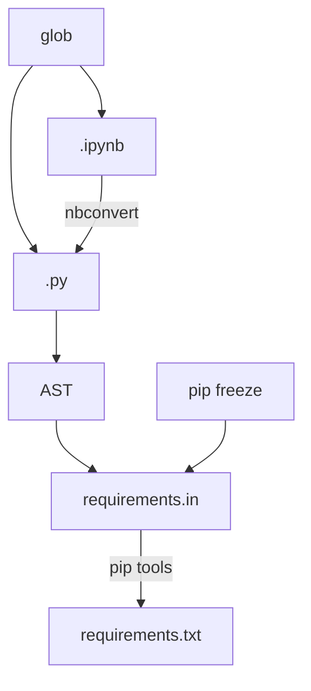

# Did I forget any imports?

DIFAI searches for import statements for all the python and jupyter notebook files in the current directory. It then uses `pip freeze` to get your installed versions and `pip-compile` to generate a `requirements.txt` file containing all of your dependencies and their depdendencies including hashes for a reproducible build. 

## Pipeline

