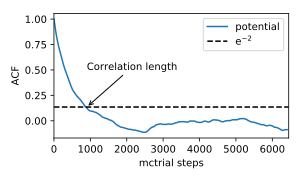

.. _advanced_topics_data_container:
.. highlight:: python
.. index::
   single: Advanced topics; Data container

Data container
==============

The results of a :term:`MC` simulation are stored in the form of a data
container object. Most ensembles use :class:`DataContainer
<mchammer.DataContainer>` objects; :ref:`Wang-Landau simulations
<example_wang_landau_simulations>` though employ
:class:`WangLandauDataContainer <mchammer.WangLandauDataContainer>` objects.
For simplicity the examples below are based on the :class:`DataContainer
<mchammer.DataContainer>` class. The use of the
:class:`WangLandauDataContainer <mchammer.WangLandauDataContainer>` objects is
largely analogous. In addition, there are several additional methods that are
specific to Wang-Landau simulations.

Accessing a data container
--------------------------

.. testsetup::

    from ase.build import bulk
    from icet import ClusterExpansion, ClusterSpace
    from mchammer.calculators import ClusterExpansionCalculator
    from mchammer.ensembles import CanonicalEnsemble
    from mchammer.observers import SiteOccupancyObserver

    # prepare cluster expansion
    prim = bulk('Au', a=1.0, crystalstructure='fcc')
    cs = ClusterSpace(prim, cutoffs=[1.1], chemical_symbols=['Ag', 'Au'])
    ce = ClusterExpansion(cs, [0, 0, 0.1, -0.02])

    # prepare initial configuration
    structure = prim.repeat(3)
    for k in range(10):
        structure[k].symbol = 'Ag'

    # set up and run MC simulation
    calc = ClusterExpansionCalculator(structure, ce)
    mc = CanonicalEnsemble(structure=structure, calculator=calc,
                           dc_filename='my_test.dc',
                           temperature=600)
    sof = SiteOccupancyObserver(cs, sites={'A': [0]}, structure=structure)
    mc.attach_observer(sof)
    mc.run(len(structure)*10)  # carry out 100 trial sweeps

The data container be accessed via the :func:`data_container
<mchammer.ensembles.CanonicalEnsemble.data_container>` property of the
ensemble:

.. doctest::

    >>> dc = mc.data_container  # here mc is DataContainer

More commonly the data container is written to file during the simulation and
can then be read from file for analysis. (N.B.: To trigger saving the data
container a filename has to be provided when initializing the ensemble.) The
data container can be read via the :func:`read <mchammer.DataContainer.read>`
function, e.g., (assuming the name of data container file in `my_test.dc`)

.. doctest::

    >>> from mchammer import DataContainer
    >>> dc = DataContainer.read('my_test.dc')

The :class:`DataContainer <mchammer.DataContainer>` class provides ample
functionality for processing data and extracting various observables that are
briefly introduced below.

Extracting data
---------------

The raw data as a function of MC trial step can be obtained via the :func:`get
<mchammer.DataContainer.get>` function, which also allows slicing data by
specifying an initial MC step. This is useful e.g., for discarding the
equilibration part of a simulation. In the following snippet we retrieve all
observations of `potential` starting with the 100-th trial step:

.. doctest::

    >>> energy = dc.get('potential', start=100)

The :func:`get <mchammer.DataContainer.get>` function also allows extracting
several observables in parallel. Which observables are available, can be
checked using the :attr:`observables <mchammer.DataContainer.observables>`
attribute:

.. doctest::

    >>> print(sorted(dc.observables))
    ['acceptance_ratio', 'occupations', 'potential', 'sof_A_Ag', 'sof_A_Au']

The `mctrial`, `potential`, and `trajectory` observables are available by
default. `potential` refers the thermodynamic potential sampled by the
trajectory (usually defined by the cluster expansion to run the simulation).
`trajectory` refers to the atomic configurations along the trajectory.

Assume, e.g., that the original simulation
was carried out with a
:class:`SiteOccupancyObserver <mchammer.observers.SiteOccupancyObserver>`,
then site occupancy of the sites labeled 'A' with Ag could be retrieved as
follows:

.. doctest::

    >>> mctrial, energy, sro = dc.get('mctrial', 'potential', 'sof_A_Ag')

This enables one to plot observables as a function of the MC trial as
demonstrated by the following snippet:

.. doctest::

    >>> import matplotlib.pyplot as plt
    >>> s, p = dc.get('mctrial', 'potential')
    >>> _ = plt.plot(s, p)
    >>> plt.show(block=False)

The atomic configurations along the trajectory can be retrieved as a list of
:class:`Atoms <ase.Atoms>` objects using the `trajectory` observable.

.. doctest::

    >>> traj = dc.get('trajectory')

This also allows for pairing the snapshots in the trajectory with observables
in the data container.

.. doctest::

    >>> E_mix, traj = dc.get('potential', 'trajectory')

Updating data container
-----------------------

Normally :ref:`observers <observers>` are attached to an ensemble at the
beginning of an MC simulation via the :func:`attach_observer
<mchammer.ensembles.CanonicalEnsemble.attach_observer>` function. They can,
however, also be applied after the fact via the :func:`apply_observer
<mchammer.DataContainer.apply_observer>` function, provided the trajectory is
available via a :class:`DataContainer <mchammer.DataContainer>` object.

.. doctest::

    >>> from mchammer.observers import BinaryShortRangeOrderObserver
    >>> obs = BinaryShortRangeOrderObserver(cs, structure, radius=1.1)
    >>> dc.apply_observer(obs)
    >>> s, sro = dc.get('mctrial', 'sro_Ag_1')
    >>> _ = plt.plot(s, sro)
    >>> plt.show(block=False)

Afterwards the data container, including the new data, can be written back to
file using the :func:`write <mchammer.DataContainer.write>` function.

Data analysis
-------------

Data containers also allow more detailed analysis. The :func:`analyze_data
<mchammer.DataContainer.analyze_data>` function computes average, standard
deviation, correlation length, and 95% error estimate of the average for a
given observable.

.. doctest::

    >>> summary = dc.analyze_data('potential')

Here, the correlation length, :math:`s`, is estimated from the autocorrelation
function (ACF). When the ACF has decayed below :math:`\mathrm{e^{-2}}`
observations are said to be uncorrelated, providing an estimate of the
correlation length.

An `error estimate <https://en.wikipedia.org/wiki/Standard_error>`_ of the
average can be calculated via

.. math::
    \mathrm{error} = \frac{t \sigma }{\sqrt{Ns}},

where :math:`\sigma` is the standard deviation, :math:`N` the number of
samples, :math:`s` the correlation length and :math:`t` is the `t-factor
<https://en.wikipedia.org/wiki/Student%27s_t-distribution>`_, which can be
adjusted depending on the desired confidence interval.

Obtaining the autocorrelation function directly or carrying out error estimates
can be done via functionality provided in the :ref:`data_analysis
<data_container_analysis_functions>` module.

.. testcleanup::

    from os import remove
    try:
        remove('my_test.dc')
    except:
        pass