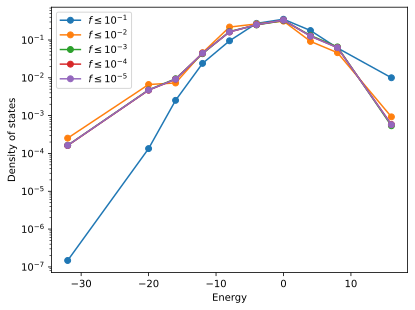
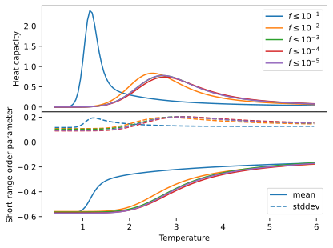
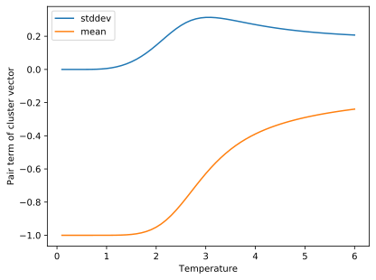
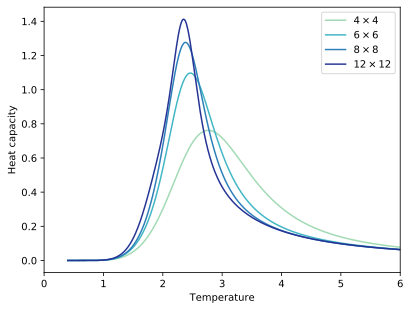
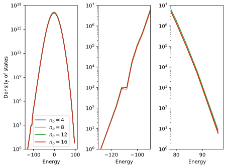
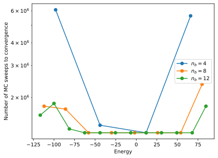
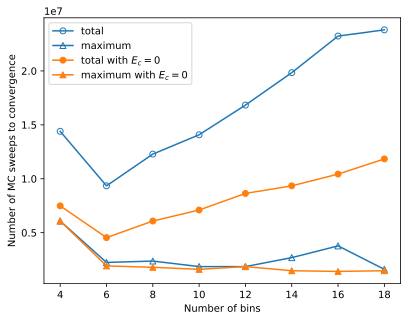
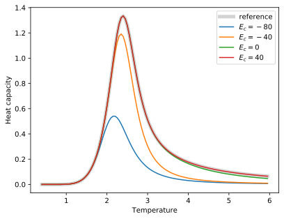

.. _example_wang_landau_simulations:
.. highlight:: python
.. index::
   single: Examples; Wang-Landau simulations

Wang-Landau simulations
=======================

This example illustrates how to carry out `Wang-Landau (WL)
<https://en.wikipedia.org/wiki/Wang_and_Landau_algorithm>`_ simulations with
:program:`icet`. Compared to :term:`Monte Carlo (MC) <MC>` simulations in
conventional thermodynamic ensembles there are a few differences to be aware
of. It is therefore strongly recommended to work through this entire example
before running your own :term:`WL` simulations.

Background
----------

When sampling a thermodynamic ensemble, say the canonical or semi-grand
canonical ones, one conducts :term:`MC` simulations at a given temperature,
commonly in order to gather thermodynamic averages of some observables. In
order to obtain the temperature dependence of these quantities one has to
conduct a series of simulations at different temperatures. In particular in
the vicinity of continuous phase transitions these simulations can become
tedious or close to impossible to converge.

Here, the :term:`WL` algorithm provides an alternative approach. It allows one
to extract the microcanonical density of states, from which many other
thermodynamic quantities can be calculated [WanLan01a]_ [LanTsaExl04]_.
Usually the :term:`density of states (DOS) <DOS>` is acquired as a function of
the energy. To this end, the :term:`WL` algorithm accumulates both the
microcanonical entropy :math:`S(E)` and a histogram :math:`H(E)` on an energy
grid with a predefined spacing (see argument ``energy_spacing`` of
:class:`WangLandauEnsemble <mchammer.ensembles.WangLandauEnsemble>`).

The algorithm is initialized as follows.

#. Generate an initial configuration.

#. Initialize counters for the microcanonical entropy :math:`S(E)` and the
   histogram :math:`H(E)` to zero.

#. Set the fill factor :math:`f=1`.

It then proceeds as follows.

#. Propose a new configuration (see argument ``trial_move`` of
   :class:`WangLandauEnsemble <mchammer.ensembles.WangLandauEnsemble>`).

#. Accept or reject the new configuration with probability

   .. math::

      P = \min \{ 1, \, \exp [ S(E_\mathrm{new}) - S(E_\mathrm{cur}) ] \},

   where :math:`E_\mathrm{cur}` and :math:`E_\mathrm{new}` are the energies of
   the current and new configurations, respectively.

#. Update the microcanonical entropy :math:`S(E)\leftarrow S(E) + f`
   and histogram :math:`H(E) \leftarrow H(E) + 1` where :math:`E` is
   the energy of the system at the end of the move.

#. Check the flatness of the histogram :math:`H(E)`. If
   :math:`H(E) > \chi \langle H(E)\rangle\,\forall E` reset the histogram
   :math:`H(E) = 0` and reduce the fill factor :math:`f \leftarrow f / 2`.
   The parameter :math:`\chi` is set via the argument ``flatness_limit`` of
   :class:`WangLandauEnsemble <mchammer.ensembles.WangLandauEnsemble>`.

#. If :math:`f` is smaller than a certain threshold (commonly between
   :math:`10^{-8}` and :math:`10^{-6}`, see argument ``fill_factor_limit``
   of :class:`WangLandauEnsemble <mchammer.ensembles.WangLandauEnsemble>`),
   terminate the loop, otherwise return to 1.

The microcanonical entropy :math:`S(E)` and the histogram along with related
information are written to the data container every time :math:`f` is updated.
Using the density :math:`\rho(E) = \exp S(E)` one can then readily compute
various thermodynamic quantities, including, e.g., the average energy:

.. math::

   \left<E\right>_T = \frac{\sum_E E \rho(E) \exp(-E / k_B T)}{
   \sum_E \rho(E) \exp(-E / k_B T)}

Similarly, it is also possible to compute averages and standard deviations of
any other observable in the data container.

2D Ising model
--------------

The `two-dimensional Ising model
<https://en.wikipedia.org/wiki/Ising_model#Two_dimensions>`_ is well suited
for demonstrating the utility of the :term:`WL` algorithm and has been
extensively studied in the literature [WanLan01a]_ [WanLan01b]_
[LanTsaExl04]_. The model exhibits a continuous phase transition, which occurs
at :math:`T_c = 2 J / k_B \ln (1 + \sqrt{2}) \approx 2.26919 J / k_B` in the
infinite system-size limit. In this example, we use the 2D Ising model as a
computationally inexpensive toy model.

The following code generates a cluster expansion that represents the 2D Ising
model. Here, Au and Ag are used as dummy species. Internally they are
represented by :math:`0` and :math:`1`, while in the Ising model the species
are represented by spins of :math:`+1` and :math:`-1`. The effective cluster
interaction for the first-nearest neighbor pair is therefore set to
:math:`J=2` (as opposed to :math:`J=1`). By means of this transformation the
energy/temperature scales remains invariant.

.. literalinclude:: ../../../examples/advanced_topics/wang_landau/1_run_simulation.py
   :start-after: # Prepare cluster expansion
   :end-before: # Prepare initial configuration

Running a WL simulation
-----------------------

For computational convenience, we consider a very small system of only
:math:`4\times4 = 16` sites.

.. literalinclude:: ../../../examples/advanced_topics/wang_landau/1_run_simulation.py
   :start-after: # Prepare initial configuration
   :end-before: # Set up WL simulation

A :term:`WL` simulation is set up similar to a thermodynamic ensemble.

.. literalinclude:: ../../../examples/advanced_topics/wang_landau/1_run_simulation.py
   :start-after: # Set up WL simulation
   :end-before: # Add short-range order observer

In the case of this very simple model, the energy spectrum is discrete and the
choice of the energy spacing is straightforward (``energy_spacing=1``). While
for arbitrary CEs the energy spectrum is technically discrete it is
practically continuous and the choice of the energy spacing requires more
care, as illustrated below.

We also note that the intervals at which data is written to the data container
are set to 10 :term:`MCS` (``ensemble_data_write_interval``) and 100
:term:`MCS` (``trajectory_write_interval``. Often :term:`WL` simulations need
to be run for a considerable number of steps. It is not uncommon that one
requires on the order of 10 to 100 million :term:`MCS` (see below). As a
result, data containers can become quite large, which can lead to a notable
memory footprint and slow down analysis. It is therefore recommend to choose
the ``write_interval`` parameters not too small.

We also attach a short-range order observer in order to illustrate the
analysis of observables other than the energy:

.. literalinclude:: ../../../examples/advanced_topics/wang_landau/1_run_simulation.py
   :start-after: # Add short-range order observer
   :end-before: # Run WL simulation

And then run the WL simulation for a number of :term:`MCS`:

.. literalinclude:: ../../../examples/advanced_topics/wang_landau/1_run_simulation.py
   :start-after: # Run WL simulation

Analyzing a WL simulation
-------------------------

The data container file contains all the information that is needed for extracting thermodynamic data from a :term:`WL` simulation.
In addition to the regular fields found in most data containers (e.g., ``mctrial``, ``potential``, or ``acceptance_ratio``), a :term:`WL` data container contains the fields ``fill_factor``, which is the current value of :math:`f`, ``histogram``, and ``entropy``.
These data are not written at every step as they consume quite a lot of space.
Rather they are only added to the data container when the fill factor :math:`f` is updated or the maximum number of MC trial steps has been reached.
While the ``entropy`` data and ``fill_factor`` values are recorded during the entire simulation, the ``histogram`` data is only stored for the last state.

:program:`icet` provides support functions to make the simplify analysis of these data.
One can for example extract the (relative) entropy as well as the :term:`DOS`.
In particular, it is possible to check the convergence of the properties of interest by specifying a `fill_factor_limit` to the analysis function, in this case `get_density_of_states_wl`.
By doing so, the results obained corresponds to data collected up to the point when the ``fill_factor`` reached below the specified limit.

.. literalinclude:: ../../../examples/advanced_topics/wang_landau/2_analyze_simulation.py
   :start-after: # Extract and plot the DOS
   :end-before: # Plot DOS

For the present, very small system, the number of energy bins is small and the :term:`DOS` is relatively rough.

.. _wl-density-figure:

   Density of states from Wang-Landau simulation of :math:`4\times4`
   two-dimensional Ising model.

Availability of the :term:`DOS` enables one for example to compute the heat
capacity as a function of temperature using the following relations:

.. math::

   \left<E^n\right> = \frac{\sum_E E^n \rho(E) \exp(-E / k_B T)}{
   \sum_E \rho(E) \exp(-E / k_B T)} \\
   C_v = \left( \left<E^2\right> - \left<E\right>^2 \right) \Big/ k_B T^2

The mean and the standard deviation of the energy as well as thermodynamic
averages of other observables can be extracted using
:func:`get_average_observables_wl
<mchammer.data_containers.get_average_observables_wl>`:

.. literalinclude:: ../../../examples/advanced_topics/wang_landau/2_analyze_simulation.py
   :start-after: # Compute thermodynamic averages
   :end-before: # Plot heat capacity

The heat capacity obtained using the :term:`WL` approach matches those from a
series of MC simulations in the canonical ensemble (not described here). The
availability of the full :term:`DOS` enables one, however, to extract the heat
capacity as a practically continuous function of temperature.

.. _wl-heat-capacity-sro-figure:

   Heat capacity (top) and short-range order parameter (bottom) from Wang-Landau
   simulation of a :math:`4\times4` two-dimensional Ising model.

Using the same approach one can also extract thermodynamic averages of other observables.
This is illustrated here by the first-nearest neighbor short-range order parameter.
Notably the standard deviation of the latter correlates with the heat capacity, corresponding to the increase (and for an infinite system, divergence) of the correlation length at the transition temperature.
Since both the :ref:`density of states <wl-density-figure>`, the :ref:`heat capacity, and the short-ranged order <wl-heat-capacity-sro-figure>` show small variations with respect to the fill factor limit, the calculations can be considered already rather well converged.
If this had not been the case, one could have continued the simulations by rerunning the script, after having reduced the value on the ``fill_factor_limit``.

Representative configurations
-----------------------------

In addition to common thermodynamic observables one can also be interested in the evolution of the structure itself as a function of temperature.
To this end, :program:`icet` provides the :func:`get_average_cluster_vectors_wl <mchammer.data_containers.get_average_cluster_vectors_wl>` function, which allows one to obtain the average cluster vectors at different temperatures:

.. literalinclude:: ../../../examples/advanced_topics/wang_landau/3_extract_structures.py
   :start-after: # Get average cluster vectors
   :end-before: # Plot pair

The result shows a systematic variation of the pair term of the cluster vector
with temperature.

   Pair term of the cluster vector of the average structure as a function of
   temperature.

Using the :func:`generate_target_structure
<icet.tools.structure_generation.generate_target_structure>` function, one can
then furthermore translate the cluster vector into a structure:

.. literalinclude:: ../../../examples/advanced_topics/wang_landau/3_extract_structures.py
   :start-after: # Get low(est) energy structure

The generation of structures from cluster vectors is described in much more
detail in :ref:`this example <advanced_topics_sqs_structures>`.

Size-dependence of transition temperature
-----------------------------------------

For the system size considered above one obtains a critical temperature of
:math:`T_c(N=16) = 2.742 J / k_B`. This is still quite far off from the value
of :math:`T_c(N\rightarrow\infty) = 2.26919 J / k_B` that one obtains
analytically for the infinite-size limit. Using the :term:`WL` algorithm this
system size dependence can be explored rather efficiently.

   Heat capacity from Wang-Landau simulations of the two-dimensional Ising
   model for different system sizes.

With increasing system size the peak in the heat capacity both sharpens and
shifts to the left, approaching the infinite-size limit in the expected
fashion.

Parallelizing Wang-Landau simulations
-------------------------------------

The larger the system, the wider the energy range, the larger the number of
bins. Moreover, in larger systems the ratio between maximum and minimum of the
:term:`DOS` increases as well. It therefore becomes increasingly tedious to
converge a :term:`WL` simulation. To combat this challenge one can split up
the energy range in multiple segments and sample each segment in a separate WL
simulation. After the algorithm has reached convergence for each segment, the
:term:`DOS` can be patched together. This approach has at least two crucial
advantages:

#. The extraction of the :term:`DOS` can be parallelized.

#. The number of steps required for converging one segment is smaller than the
   number of steps required to converge the :term:`DOS` without binning.

:program:`icet` allows one to run binned simulations by setting the
``energy_limit_left`` and ``energy_limit_right`` keyword arguments of the
:class:`WangLandauEnsemble <mchammer.ensembles.WangLandauEnsemble>` class.
For very small systems such as the one considered above, binning the energy
range is actually ineffective. The number of energy levels is simply too
small. To demonstrate the benefit of binning, here, we therefore show results
from a set of simulations for a system with :math:`8\times8=64` sites,
which is set up in the same way as before.

.. literalinclude:: ../../../examples/advanced_topics/wang_landau/4_run_binned_simulation.py
   :start-after: # Prepare cluster expansion
   :end-before: # Define parameters

As is detailed in a separate example, :ref:`Monte Carlo simulations can be run
in parallel <advanced_topics_parallel_monte_carlo_simulations>` using the
`multiprocessing package
<https://docs.python.org/3/library/multiprocessing.html>`_. The same approach
can be applied in the present case, i.e. to run multiple :term:`WL` simulations
for separate energy bins, provided that the run script presented in the previous
sections has been appropriately modified. Firstly, one needs to define a wrapper
function, which sets up and runs a single simulation using the
:class:`WangLandauEnsemble <mchammer.ensembles.WangLandauEnsemble>` class,
given a dictionary containing all the required arguments:

.. literalinclude:: ../../../examples/advanced_topics/wang_landau/4_run_binned_simulation.py
   :start-after: # Define a function
   :end-before: # Prepare cluster expansion

In order to be able to define the input parameters for the individual
simulations, one should begin by generating sets of overlapping energy bins
using, e.g., the :func:`get_bins_for_parallel_simulations
<mchammer.ensembles.wang_landau_ensemble.get_bins_for_parallel_simulations>`
function. The output from the latter, in the form of a list of tuples containing
the lower and upper energy limits for each of the bins, are then collected,
together with all common arguments, in a list of dictionaries:

.. literalinclude:: ../../../examples/advanced_topics/wang_landau/4_run_binned_simulation.py
   :start-after: # Define parameters
   :end-before: # Initiate a Pool

The final step is to initiate a `multiprocessing Pool object
<https://docs.python.org/3.7/library/multiprocessing.html#multiprocessing.pool
.Pool>`_ and, at the same time, decide the number of processes that will be run
simultaneously. Although the latter could, potentially, be set equal to the
number of available cores, one should also take the memory requirements into
account. Next, the simulations are started by mapping the list of input
arguments to the wrapper function:

.. literalinclude:: ../../../examples/advanced_topics/wang_landau/4_run_binned_simulation.py
   :start-after: # Initiate a Pool

.. note::
    It is strongly recommended to use the functions for asynchronus mapping,
    specifically `Pool.map_async <https://docs.python.org/3.7/library/
    multiprocessing.html#multiprocessing.pool.Pool.map_async>`_ and
    `Pool.starmap_async <https://docs.python.org/3.7/library/multiprocessing
    .html#multiprocessing.pool.Pool.starmap_async>`_. The reason for this is
    that these, in contrast to `Pool.map <https://docs.python.org/3.7/library/m
    ultiprocessing.html#multiprocessing.pool.Pool.map>`_ and `Pool.starmap
    <https://docs.python.org/3.7/library/multiprocessing.html#multiprocessing
    .pool.Pool.starmap>`_, do not block the main process, which can cause some
    of the child processes to hang when running Monte Carlo simulations using
    functionalities imported from the :ref:`mchammer <moduleref_mchammer>`
    module.

The functions that were previosuly used for analyzing the output from the
serial simulations can be applied in this case as well. More precisely, this is
achieved by providing a dictionary with the :class:`WangLandauDataContainer
<mchammer.WangLandauDataContainer>` objects obtained from the separate runs to,
e.g., :func:`get_density_of_states_wl
<mchammer.data_containers.get_density_of_states_wl>`, for the purpose of
collecting the :term:`DOS`:

.. literalinclude:: ../../../examples/advanced_topics/wang_landau/5_analyze_binned_simulation.py
   :start-after: # Get density and entropy
   :end-before: # Plot density

An analysis of the resulting diagrams reveals that one recovers the
correct density of states, as well as the heat capacity, regardless of
the number of bins. In particular the distinctive features in the
low-energy range, which are visible in the middle panel and correspond
to the occurrence of ordered structures, are reproduced for all bin
sizes.

   Density of states from binned Wang-Landau simulations for a
   :math:`8\times8` system using a varying number of bins :math:`n_b`.

The number of :term:`Monte Carlo sweeps (MCS) <MCS>` required to reach
convergence, here :math:`f<10^{-6}`, in a certain energy range, scales
approximately inversely with the :term:`DOS` in the respective
bin. The low and high-energy regions therefore require a much larger
number of :term:`MCSs` than the central regions (see figure
below). Moreover, the smaller the energy range (and hence the smaller
the number of distinct energies) the lower the number of :term:`MCSs`
required to achieve convergence.

.. _wl-binned-nsteps-figure:

   Number of :term:`MCSs` required to achieve convergence (:math:`f<10^{-6}`)
   as a function of the energy from simulations using a varying number of bins
   :math:`n_b` (top) as well as with and without a cutoff (bottom) for a
   :math:`8\times8` system.

This demonstrates how binning can be beneficial not only since it allows for
parallelization but since a limited energy range can be sampled more quickly,
leading to faster convergence.

A further reduction of computational cost can be achieved by realizing that
one often does not require the :term:`DOS` to be converged in the entire
energy range. It is usually the low energy range that dominates under most
thermodynamically relevant conditions. Under such circumstances, it is thus
sufficient to only include bins up to a certain cutoff energy :math:`E_c`.
In practice, this is achieved by only including data containers that
correspond to bins for which the upper energy limit is smaller than :math:`E_c`.
One can, for instance, use the :func:`get_average_observables_wl
<mchammer.data_containers.get_average_observables_wl>`, to calculate the heat
capacity for a range of different cutoffs:

.. literalinclude:: ../../../examples/advanced_topics/wang_landau/5_analyze_binned_simulation.py
   :start-after: # Determine the heat
   :end-before: # Plot the heat

This analysis reveals (see diagram below) that a very good agreement is achieved
up to a temperature of approximately 6, compared with the data obtained using
the full energy range, even if the integration over the :term:`DOS` is cut
off beyond :math:`E_c=0`.

   Heat capacity obtained by integrating over the DOS up to a certain
   cutoff energy :math:`E_c` for a :math:`8\times8` system.

This translates to a further reduction in the number of :term:`MCSs`
required for convergence (orange symbols in :ref:`the figure presented earlier
<wl-binned-nsteps-figure>`). The data above suggest that further optimization
could be possible by using an inhomogeneous distribution of bin sizes with
smaller/larger bin sizes at the boundaries/center of the energy range. An option
that is not further explored here.

Further tips
------------

It is a good idea to write the data container to file in regular intervals.
This can be achieved by setting the ``data_container_write_period`` keyword
argument of :class:`WangLandauEnsemble
<mchammer.ensembles.WangLandauEnsemble>`.

Simulations can be easily restarted by rerunning the original run script
provided a data container file has been written. In that case, the last state
of the simulation will be restored from the data container.

At the beginning of the simulation, the potential of the initial configuration
is not guaranteed to fall within the specified energy range. In that case, a
WL simulation over the entire energy range is carried out *until* the targeted
energy range has been reached. In order to shorten this initial
"equilibration" period, one can start the simulation from suitable
configurations. Since it easier to find high-density configurations, a
suitable approach is to start from known ground state (or very low energy)
configurations to sample the lower-energy region.

Source code
-----------

.. container:: toggle

    .. container:: header

       The complete source code is available in
       ``examples/1_run_simulation.py``

    .. literalinclude:: ../../../examples/advanced_topics/wang_landau/1_run_simulation.py

.. container:: toggle

    .. container:: header

       The complete source code is available in
       ``examples/2_analyze_simulation.py``

    .. literalinclude:: ../../../examples/advanced_topics/wang_landau/2_analyze_simulation.py

.. container:: toggle

    .. container:: header

       The complete source code is available in
       ``examples/3_extract_structures.py``

    .. literalinclude:: ../../../examples/advanced_topics/wang_landau/3_extract_structures.py

.. container:: toggle

    .. container:: header

       The complete source code is available in
       ``examples/4_run_binned_simulation.py``

    .. literalinclude:: ../../../examples/advanced_topics/wang_landau/4_run_binned_simulation.py

.. container:: toggle

    .. container:: header

       The complete source code is available in
       ``examples/5_analyze_binned_simulation.py``

    .. literalinclude:: ../../../examples/advanced_topics/wang_landau/5_analyze_binned_simulation.py
