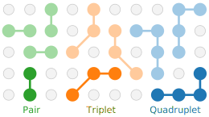

.. _workflow:
.. index:: Workflow

.. raw:: html

    
    
    

.. role:: orange
.. role:: blue
.. role:: green

Workflow
********

.. note::

    This page provides an overview of the :program:`icet` workflow. For detailed
    instructions on how to use :program:`icet`, please see the :ref:`tutorial
    section <tutorial>`. Further applications are discussed in the
    :ref:`advanced topics <advanced_topics>` section.

Overview
========

The following figure illustrates the :program:`icet` *workflow*. Here, classes
are shown in :blue:`blue`, input parameters and data in :orange:`orange`, and
functionalities invoked via external libraries are indicated in :green:`green`.

.. graphviz:: _static/workflow.dot

The typical workflow involves the following steps:

#. initialize a :ref:`cluster space <workflow_cluster_space>` (via
   :class:`ClusterSpace <icet.ClusterSpace>`) by providing a :orange:`prototype
   structure` (typically a primitive cell), the :orange:`species` that are
   allowed on each site as well as :orange:`cutoff radii for clusters of
   different orders`

#. initialize a :ref:`structure container <workflow_structure_container>` (via
   :class:`StructureContainer <icet.StructureContainer>`)
   using the cluster space created previously and add a :orange:`set of input
   structures with reference data` for the property or properties of interest

#. fit the parameters using an :ref:`optimizer <workflow_optimizers>` (e.g.,
   :class:`Optimizer <trainstation.Optimizer>`,
   :class:`EnsembleOptimizer <trainstation.EnsembleOptimizer>`, or
   :class:`CrossValidationEstimator <trainstation.CrossValidationEstimator>` from the :program:`trainstation` package)

#. construct a :ref:`cluster expansion <workflow_cluster_expansion>`
   (via :class:`ClusterExpansion <icet.ClusterExpansion>`)
   by combining the cluster space with a set of parameters obtained by
   optimization

The final cluster expansion can be used in a number of ways. Most commonly one
creates a :ref:`cluster expansion calculator
<workflow_cluster_expansion_calculator>` (via :class:`ClusterExpansionCalculator
<mchammer.calculators.ClusterExpansionCalculator>`) for a specific
:orange:`supercell structure` and subsequently carries out Monte Carlo
simulations via the :ref:`mchammer <moduleref_mchammer>` module

It is also possible to use a :ref:`cluster expansion
<workflow_cluster_expansion>` (via :class:`ClusterExpansion
<icet.ClusterExpansion>`) directly to make predictions for :orange:`arbitrary
supercells` of the primitive prototype structure, obtained e.g., by
:ref:`structure enumeration <structure_enumeration>`.

Key concepts
============

.. _workflow_cluster_space:

Cluster spaces
--------------

A cluster space (represented by the :class:`ClusterSpace <icet.ClusterSpace>`
class) is defined by providing a prototype structure (usually a primitive
cell), the species allowed on each site, and a set of cutoffs for each
(cluster) order to be included, as demonstrated in the tutorial section that
illustrates the :ref:`basic construction of a cluster expansion
<tutorial_construct_cluster_expansion>`. It contains the set of clusters
(pairs, triplets, quadruplets etc.) and orbits into which a structure
can be decomposed. (An orbit is a set of symmetry equivalent clusters, see
figure below). Such a decomposition is referred to as a *cluster vector*.

In simpler terms, a cluster vector is a numerical representation of an alloy
structure, and a cluster space enables such representations to be obtained.

    Clusters representing different orbits: one pair, one triplet, and one
    quadruplet. An orbit comprises all clusters that are equivalent under the
    symmetry operation of the underlying lattice.

.. _workflow_structure_container:

Structure containers
--------------------

A structure container (represented by the :class:`StructureContainer
<icet.StructureContainer>` class) is a collection of structures along with
their cluster vectors. Structure containers allow one to easily compile
structures for training and validation, as demonstrated in the tutorial on
:ref:`basic construction of a cluster expansion
<tutorial_construct_cluster_expansion>`. They can also be written to file for
later use.

.. _workflow_optimizers:

Optimizers
----------

Optimizers allow one to train the effective cluster interactions (:term:`ECI`) associated with each :term:`orbit` in the :ref:`cluster space <workflow_cluster_space>`.
This functionality is maintained in the :program:`trainstation` package, the documentation of which can be found `here <https://trainstation.materialsmodeling.org>`_ and which provides optimizer classes such as :class:`Optimizer <trainstation.Optimizer>`, :class:`EnsembleOptimizer <trainstation.EnsembleOptimizer>` and :class:`CrossValidationEstimator <trainstation.CrossValidationEstimator>`.

.. note::

   The optimized parameters returned by the optimizer are actually not
   the :term:`ECIs` themselves but the :term:`ECIs` times the
   multiplicity of the respective orbit. The distinction is handled
   internally but it is something to be aware of when inspecting the
   parameters directly.

.. _workflow_cluster_expansion:

Cluster expansions
------------------

A cluster expansion (CE; represented by the :class:`ClusterExpansion
<icet.ClusterExpansion>` class) is obtained by combining a cluster space with
a set of parameters as illustrated in the tutorial on :ref:`basic construction
of a cluster expansion <tutorial_construct_cluster_expansion>`. CEs are the
main output of the :program:`icet` model construction cycle. While they are
specific for a given prototype structure and cluster space they are *not* tied
to a specific supercell structure. CEs can be written to file for later use.

.. _workflow_cluster_expansion_calculator:

Cluster expansion calculators
-----------------------------

A cluster expansion calculator (represented by the
:class:`ClusterExpansionCalculator
<mchammer.calculators.ClusterExpansionCalculator>` class) is needed in order
to carry out Monte Carlo simulations via the :program:`mchammer`
:ref:`module <moduleref_mchammer>`. They are generated by applying a CE to a
specific supercell and are subsequently used to initialize a Monte Carlo
ensemble as shown in
:ref:`the MC tutorial section <tutorial_monte_carlo_simulations>`.
