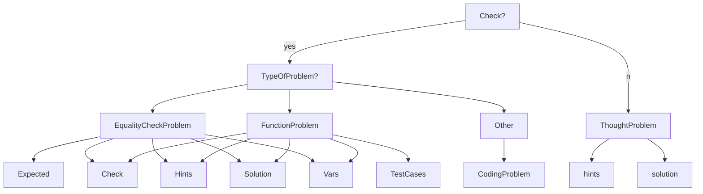

# The Bridge Coding Problems Autochecker (CPA)




## Steps for PyPI publishing

1. Create a package folder (`learntools`) containing separated modules (e.g. `core`, `python`, ...).
2. Each module contains the solutions for each of the problems. We can separate the problems in different blocks. For example, one for `Python Basics`, another one for `pandas` and so on.
3. The next file is `__init__.py`. The double underscores in the filename tell you that this is a special file. `__init__.py` represents the root of each package. It should usually be kept quite simple, but it’s a good place to put package constants, documentation, ... 
   - Inside **init** we export modules so that, calling `from learntools.core import *` we can have access to that modules, e.g. `binder` without doing, `learntools.core..globals_binder.binder`.
4. In `notebooks` folder we are going to test the modules. **TODO**: Introduce testing files and introduce them in a *test* folder.
5. Each Python project should use a file named `pyproject.toml` to specify its build system. In this case, the one specified is *setuptools* as a build system as well as which dependencies Python must install in order to build your package. Typically, the documentation of your chosen build system will tell you how to write the build-system table in *pyproject.toml*.
6. The more interesting information that you need to provide concerns your package itself. *PEP 621* defines how metadata about your package can also be included in *pyproject.toml* in a way that’s as uniform as possible across different build systems.
7. Update version:
    ```
    bumpver update [--major | --minor | --patch] 
    ```
8. Generate wheel and source files inside `dist` folder
    ```
    python –m build
    ```
9. Update dependencies in `pyproject.toml` and in this README
10. Update the Changelog
11. Publish the package
    ```
    twine upload dist/*
    ```
12. Update the tag on Git and push the commit
    ```
    git tag vx.y.z
    ```
## Dependencies tracking
[07/09/22] core: [`pandas`]
[v1.1.0] problem_view: [`ipywidgets`]

## Next Steps
- Introduce testing files and introduce them in a *test* folder
- Fill *LICENSE* file
- Make it pretty (KISS: Keep It Simple Stupid)
- Hints monitoring in order to get indsights of student's development

## Changelog
### 1.1.0
- Try to add buttons using, for example, `ipywidgets` [#DONE in v1.1.0]
  - The code can be optimized playing with @display and creating a decorator for the buttons [**TODO**][problem_view.py]